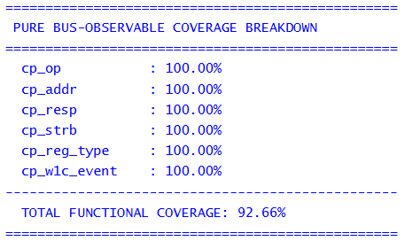
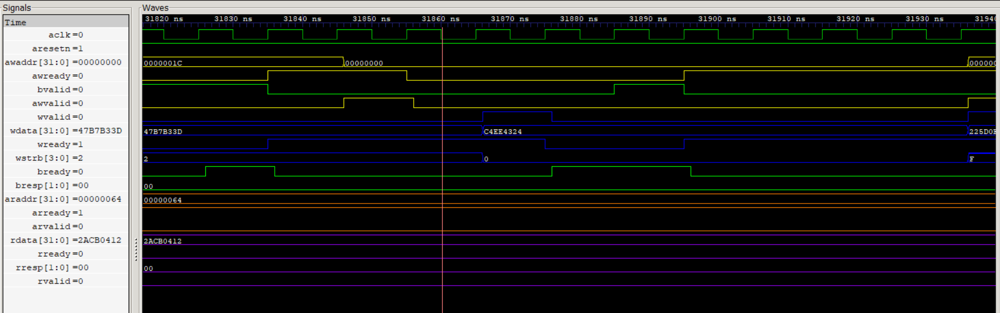
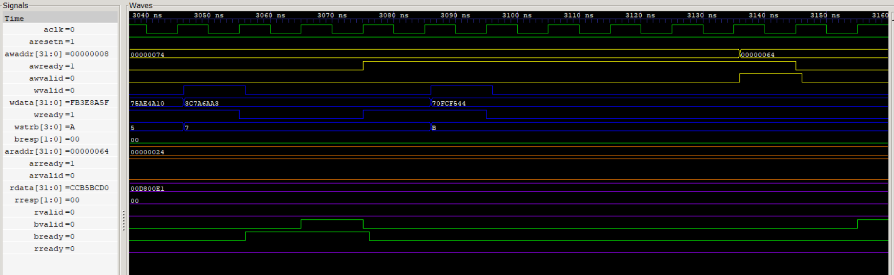
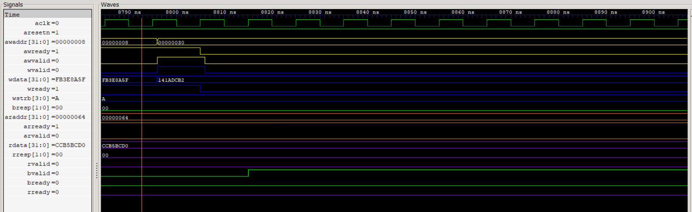

# AXI4-Lite Memory-Mapped Slave IP & UVM Verification Environment


## Overview
This repository contains the RTL design and complete industrial-grade UVM verification environment for a custom **AXI4-Lite Memory-Mapped Slave Peripheral**. The IP features write-channel independence, byte-strobe support, and a robust register map with hardware protection (RO, WO, W1C). 

The verification environment utilizes a **Constrained-Random UVM Testbench** integrated with a Register Abstraction Layer (RAL) and SystemVerilog Assertions (SVA) to achieve **100% bus-observable functional coverage**.

## Key Features
* **Protocol Compliance:** Fully compliant with the AMBA AXI4-Lite specification.
* **True Channel Independence:** Supports delayed, simultaneous, or inverted arrival of `AW` (Address) and `W` (Data) channels.
* **Advanced Register Protection:** Hardware-level decoding for Read-Only (RO), Write-Only (WO), Write-1-to-Clear (W1C), and reserved bits.
* **Byte Strobe Support (`WSTRB`):** Partial word writes (1, 2, or 3 bytes) are fully supported.
* **Master Backpressure Resiliency:** Zero data loss or protocol violations during heavy `BREADY` or `RREADY` stalls.

## Verification Highlights
* **UVM Architecture:** Full agent-based topology (Driver, Monitor, Sequencer, Scoreboard).
* **UVM RAL:** Automated frontdoor register testing and backdoor predictive checking.
* **SVA Binding:** Concurrent assertions bound to the physical interface to prove zero-defect handshake stability.
* **Coverage Closure:** Passive, bus-observable functional coverage model tracking operations, addresses, responses, byte strobes, and illegal access crosses.

## Results & Waveforms

### Functional Coverage Closure
<p align="center">
  
</p>

### Protocol Verification Waveforms

**1. Independent Write Channel Handshake (AW Before W)**  
<p align="center">
  
</p>

> *Demonstrates AXI4-Lite's decoupled write address and write data channels. The slave independently accepts the write address, buffers the transaction, and completes the write only after the delayed write data handshake arrives.*

---

**2. Independent Write Channel Handshake (W Before AW)**  
<p align="center">
  
</p>

> *Demonstrates the reverse timing scenario where write data arrives before the write address. The slave correctly stores the incoming data and waits for the corresponding address before committing the transaction, proving full support for independent AXI write channels.*

---

**3. Simultaneous Address & Data Handshake**  
<p align="center">
  
</p>

> *Demonstrates the optimized write path where both address and data channels handshake in the same clock cycle, allowing the slave to complete the transaction with minimum latency.*

---

**4. Master Backpressure Handling**  
<p align="center">
  
</p>

> *Demonstrates protocol-compliant response handling under master backpressure. The slave keeps the response (`BVALID`/`RVALID`) and associated data stable until the master finally asserts `BREADY` or `RREADY`, fully complying with the AXI4-Lite specification.*

## Directory Structure

```text
AXI-UVM-PROJECT
├── assertions/         # SystemVerilog Assertions (SVA)
├── docs/               # Architecture, Verification Plan and Documentation
├── interfaces/         # AXI4-Lite Interface Definitions
├── rtl/                # AXI4-Lite Slave RTL Implementation
├── tb_top/             # Top-Level Testbench Files
├── tests/              # UVM Tests (Directed, Random and Regression)
├── uvm_tb/             # UVM Environment
├── .gitignore
└── README.md
```